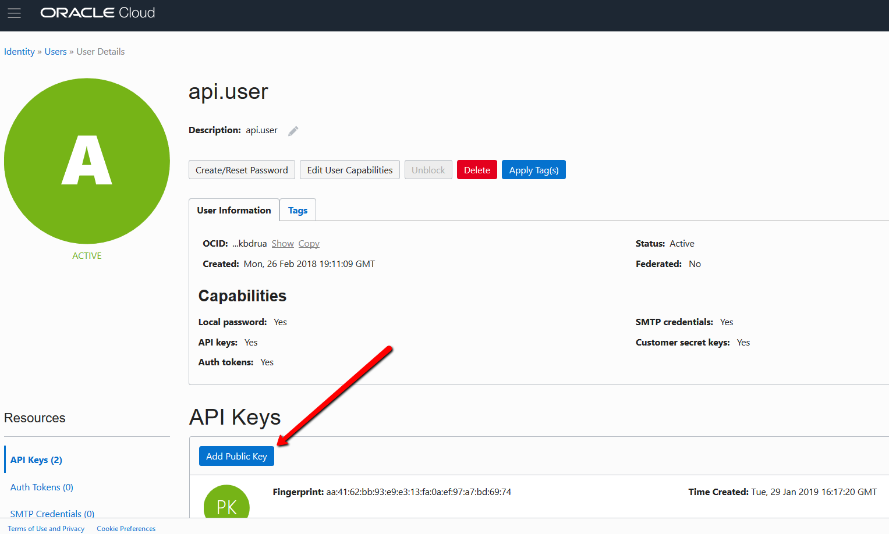

# Face Recognition API


## Basic Instalation - Steps

UBUNTU: If you are using Ubuntu, run: $ sudo apt-get install -y libsm6 libxext6 libxrender-dev ffmpeg

WINDOWS: If you are using Windows, download FFmpeg (https://www.ffmpeg.org/download.html) and add the bin folder to your system path.

1) Create a new Python or Anaconda environment: $ conda create -n facerec python=3.6 -y

2) Activate your environment: $ activate facerec

3) Install the packages of the requirement.txt file: 
    - If you have CPU: $ pip install -r requirement-cpu.txt
    - If you have GPU: $ pip install -r requirement-gpu.txt

4) Start the application: $ python server.py

5) Open your browser and access the Console: http://<HOST_IP_OR_LOCALHOST>:5000/ui


## Oracle Cloud Infrastructure Object Storage - Steps

It is possible to download or upload all your images to Oracle Cloud Infrastructure Object Storage.

1) Open the deployment.json file and change the following parameter:
    - "OCI_STORAGE_SYNC": true

2) Update the config/config.prod file with your Oracle Cloud Account information.

3) Generate public and private API keys.
```shell
cd  ~/face_recognition_api/config
openssl genrsa -out ~/face_recognition_api/config/oci_api_key_private.pem 2048
chmod go-rwx ~/face_recognition_api/config/oci_api_key_private.pem
openssl rsa -pubout -in ~/face_recognition_api/config/oci_api_key_private.pem -out ~/face_recognition_api/config/oci_api_key_public.pem
# add this public key to your profile under Identity > Users > User Details > API Keys
cat ~/face_recognition_api/config/oci_api_key_public.pem
-----BEGIN PUBLIC KEY-----
MIIBIjANBgkqhkiG9w0BAQEFAAOCAQ8AMIIBCgKCAQEAo/7hKYCiExQJjo3C4M+V
QVgBowAUYRRRCEIkkfolpYSlHuyfl0Y34OuYlat6mqnZReuSl6MKa2e8PKIHfa4T
0s/01cWvgETYnFty6lskNQO3eGO1KIQ5rZCSuCgcrnWNUzYKQ+0FopSDHj1BPzbv
9Kr13cE9BRU7nBYyG4hGbjUmY9qt6LUKR/MzZZjI5+IAlwpywlYN7X2uwUf30K/c
M/zUpgSZNNiI9lwnJB679pAOHBGdK0JfXEDS6VUAITgzHbNQcFcl6567LCd4U15j
1DjWAEWIObtYvzpX0nqUsn8Is8GoS6eTQBes8Nhf+rUgLSodsP8rGBboWtkDfRBk
9wIDAQAB
-----END PUBLIC KEY-----
```

4) Copy the Public Key output and upload it by Signing in to the Console and pasting it under Identity > Users > User Details > API Keys.




## Mobile Application

Use  as your mobile app.


## Usage

1) /face/add: This operation adds a new human face to the Face Recognition API database. You can upload videos or images that contain only one person.

2) /face/classify: This opertaion to execute a face recognition. You can upload images that contains only one person.

3) /face/train: This operation trains the model to recognize the new faces added by the "/face/add" operation.

4) /face/restart: This operation reloads the Face Recognition API model if you experience any problems.


## Inspiration

I use the  implementation in this code.


## License

This project is 