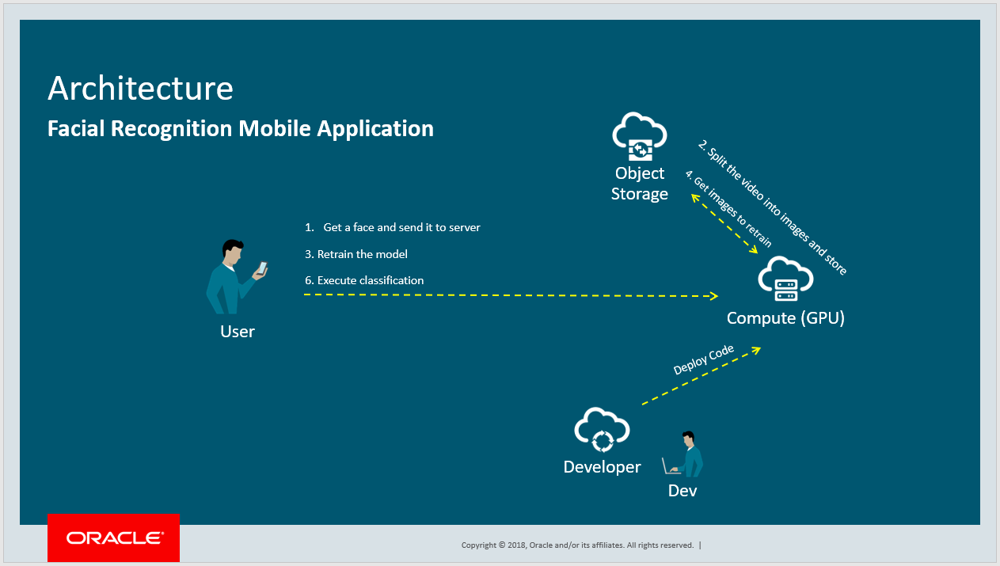

# Face Recognition

## FACE RECOGNITION SERVER

1) Update the deployment.json file with your credentials and folders information.
2) Create a new Python or Anaconda environment: conda create -n facerec python=3.6
3) Activate your environment: activate facerec
4) Install the packages of the requirement.txt file using PIP: pip install -r requirement.txt
5) Start the application: python server.py
6) Open your browser and access: http://<HOST_IP_OR_LOCALHOST>:5000/ui

## OPERATIONS

1) /face/add: Add a new faces to the model
2) /face/classify: Execute the face recognition
3) /face/restart: Reload the model
4) /face/train: Train the model with new faces